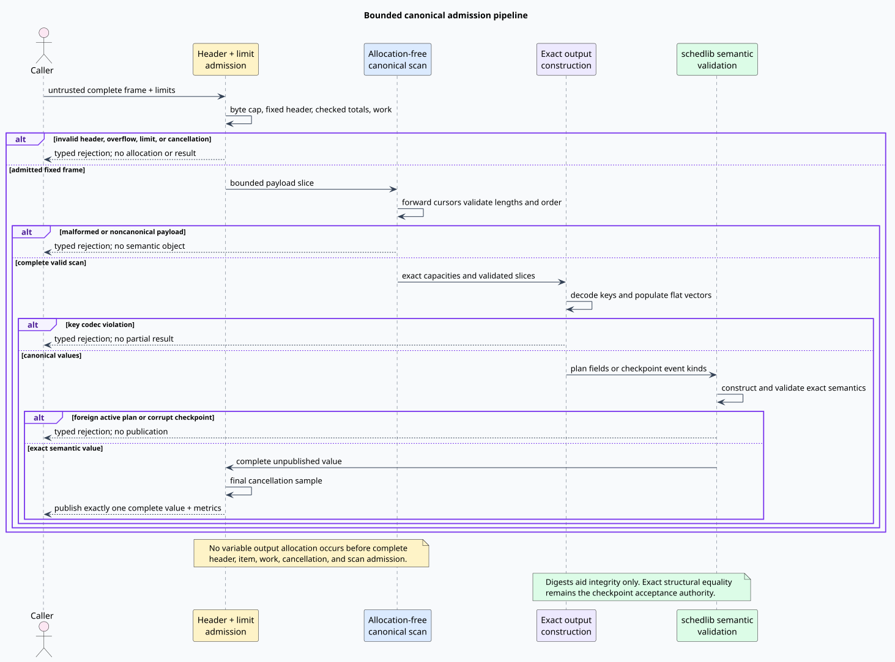

# Documentation map

schedlib-interop documents each concern at the layer that owns it:

- [theory](theory/canonical-refinement.md) explains canonical representation,
  exact structural identity, and refinement;
- [architecture](design/architecture.md) assigns semantic, codec, and storage
  responsibilities;
- [wire contract](design/wire-contract.md) specifies every version-one byte;
- [engineering](engineering/verification.md) defines algorithms, complexity,
  stack safety, tests, and acceptance;
- [scientific evidence](scientific/evidence.md) records the independent
  evidence ladder;
- [security](security/threat-model.md) defines the trust boundary and
  fail-closed controls;
- [usage](usage/rust-api.md) shows bounded plan and checkpoint workflows;
- [glossary](GLOSSARY.md) defines recurring terms; and
- [formal contract](../formal/README.md) maps all forty invariants to proofs,
  models, solvers, oracles, mutants, and Rust properties.

The admission pipeline is illustrated below.

[PlantUML source for the admission pipeline](design/figures/admission-pipeline.puml)
